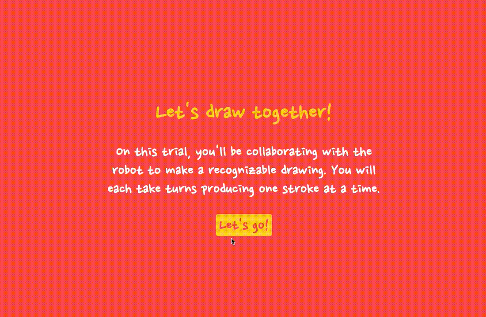

# `collabdraw`: an environment for collaborative sketching with an artificial agent 
[Judy Fan](https://cogtoolslab.github.io), [Monica Dinculescu](https://meowni.ca/), & [David Ha](http://otoro.net/)

## Overview
Sketching is a natural way to communicate our ideas quickly and to collaborate in real time to produce meaningful content. Here we present a web-based environment for collaborative sketching of everyday visual concepts. We explore the integration of an artificial agent, instantiated as a recurrent neural network ([sketch-rnn](https://ai.googleblog.com/2017/04/teaching-machines-to-draw.html)), who is both cooperative and responsive to actions performed by its human collaborator. To evaluate the quality of the sketches produced in this environment, we conducted an experimental user study and found that sketches produced collaboratively were just as recognizable as those produced by humans on their own.  Further control analyses suggest that the semantic properties of these sketches were indeed the product of collaboration, rather than attributable to the contributions of the human or the artificial agent alone. Taken together, our findings attest to the potential of systems enabling real-time collaboration between humans and machines to create novel and meaningful content. 

<pre>

</pre>

## [Explore gallery of collaborative sketches](gallery/)

 

<pre>

</pre>

## [Read our ACM Creativity & Cognition '19 short paper](paper/collabdraw_revised_accessible.pdf)

<pre>

</pre>

## [Play the collabdraw game](https://cogtoolslab.org:8888/collab96/collab.html)

### Also check out: [magic sketchpad game](https://magic-sketchpad.glitch.me/) and [sketch-rnn](https://github.com/tensorflow/magenta/tree/master/magenta/models/sketch_rnn)
